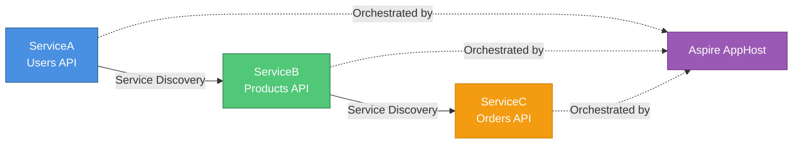

# .NET Microservices with Service Discovery + Kiota

[](https://dotnet.microsoft.com/)
[](https://kubernetes.io/)
[](https://learn.microsoft.com/en-us/dotnet/aspire/)
[](https://learn.microsoft.com/en-us/openapi/kiota/)
[](LICENSE)

> **[Documentação em Português](docs/README.pt-BR.md)**

A proof-of-concept for automatic service discovery in .NET microservices using Kubernetes labels, Kiota-generated HTTP clients, and .NET Aspire orchestration.

**Key claim:** eliminates hardcoded URLs and validates API contracts at compile time.

---

## Architecture



Call chain: `ServiceA → ServiceB → ServiceC`

| Service | Namespace | Responsibility |
|---------|-----------|----------------|
| ServiceA | `users-ns` | Users API, entry point |
| ServiceB | `products-ns` | Products API |
| ServiceC | `orders-ns` | Orders API |

---

## How Service Discovery Works

### Local (Aspire)

Zero configuration needed. Aspire's DCP injects environment variables automatically, and `Microsoft.Extensions.ServiceDiscovery` resolves `http://serviceb` to the real port.

```csharp
// apphost.cs
var serviceA = builder.AddProject<Projects.ServiceA>("servicea");
var serviceB = builder.AddProject<Projects.ServiceB>("serviceb");
var serviceC = builder.AddProject<Projects.ServiceC>("servicec");
```

### Kubernetes

**This POC implements automatic discovery via Kubernetes labels.** Services annotate themselves with `api-type` labels; consumers query the K8s API at startup to resolve URLs, then cache the result.

```yaml
# serviceb Service manifest
metadata:
  labels:
    api-type: products-api   # ← discoverable label
```

```csharp
// Resolved once at startup, cached for the process lifetime
_cachedBaseUrl ??= await ResolveBaseUrlAsync();
```

Resolution falls back hierarchically: **K8s label lookup → appsettings config → default URL**.

> **Aspire scope limitation:** Aspire service discovery only works within the same AppHost. For cross-solution communication in Kubernetes, use fully-qualified DNS names (`http://serviceb.products-ns.svc.cluster.local`) or a service mesh.

---

## Kiota: Type-Safe Clients

Kiota generates HTTP clients from OpenAPI specs. If ServiceB renames a field, `dotnet build` fails in ServiceA — catching contract breaks at compile time instead of runtime.

```bash
# Install
dotnet tool install --global Microsoft.OpenApi.Kiota

# Generate client
cd ServiceA
kiota generate -l CSharp \
  -d ../ServiceB/openapi.json \
  -o ./Generated/ServiceBClient \
  -n ServiceA.Clients.ServiceB
```

Regenerate whenever the OpenAPI spec changes. The CI pipeline does this automatically (see [docs/OPENAPI-WORKFLOW.md](docs/OPENAPI-WORKFLOW.md)).

---

## Project Structure

```
dotnet-playground-test/
├── apphost.cs                    # Aspire orchestrator
├── DotNetPlayground.sln
├── ServiceA/                     # Users API
│   ├── Generated/ServiceBClient/ # Kiota-generated client
│   └── openapi.json
├── ServiceB/                     # Products API
│   ├── Generated/ServiceCClient/ # Kiota-generated client
│   └── openapi.json
├── ServiceC/                     # Orders API
├── ServiceA.Tests/               # Integration tests (WebApplicationFactory + fakes)
│   └── Fakes/
│       ├── FakeKubernetesServiceDiscovery.cs
│       ├── FakeHttpClientFactory.cs
│       └── FakeServiceBMessageHandler.cs
├── k8s/                          # Kubernetes manifests
└── docs/                         # Extended documentation
```

---

## Running Locally

**Prerequisites:** .NET SDK 10.0, Kiota CLI

```bash
# From the repo root
dotnet run apphost.cs
```

Aspire Dashboard opens at `https://localhost:17247`. Use the token printed in the console.

### Test the service chain

```bash
# Replace {PORT} with ServiceA's port shown in the dashboard
curl http://localhost:{PORT}/api/users/with-products/1
```

Expected response:
```json
{
  "Message": "ServiceA called ServiceB via service discovery",
  "Products": "[{\"Id\":1,\"Name\":\"Laptop\",\"Price\":999.99},...]"
}
```

Or browse to `/scalar` on any service for interactive API docs.

---

## Kubernetes Deployment

```bash
# Build and push images
docker build -t your-registry/servicea:latest ./ServiceA
docker build -t your-registry/serviceb:latest ./ServiceB
docker build -t your-registry/servicec:latest ./ServiceC

# Deploy
kubectl apply -f k8s/00-namespaces.yaml
kubectl apply -f k8s/01-servicea-deployment.yaml
kubectl apply -f k8s/02-serviceb-deployment.yaml
kubectl apply -f k8s/03-servicec-deployment.yaml

# Verify
kubectl get pods -n users-ns
kubectl get pods -n products-ns
kubectl get pods -n orders-ns
```

See [docs/k8s/README.md](docs/k8s/README.md) for RBAC setup, network policies, and troubleshooting.

---

## API Endpoints

| Service | Endpoint | Notes |
|---------|----------|-------|
| ServiceA | `GET /api/users` | List users |
| ServiceA | `GET /api/users/{id}` | Get user |
| ServiceA | `POST /api/users` | Create user |
| **ServiceA** | **`GET /api/users/with-products/{id}`** | **Calls ServiceB** |
| ServiceB | `GET /api/products` | List products |
| ServiceB | `GET /api/products/{id}` | Get product |
| ServiceB | `PUT /api/products/{id}` | Update product |
| **ServiceB** | **`GET /api/products/with-orders/{id}`** | **Calls ServiceC** |
| ServiceC | `GET /api/orders` | List orders |
| ServiceC | `GET /api/orders/{id}` | Get order |
| ServiceC | `DELETE /api/orders/{id}` | Delete order |

---

## Stack

| Technology | Version | Role |
|------------|---------|------|
| .NET | 10.0 | Runtime |
| .NET Aspire | 13.1.2 | Local orchestration + service discovery |
| Kiota | 1.30.0 | Type-safe HTTP client generation |
| Scalar | 2.13.8 | API docs (Swagger alternative) |
| KubernetesClient | 19.0.2 | K8s label-based service discovery |
| Microsoft.Extensions.ServiceDiscovery | 10.4.0 | Service discovery middleware |

---

## Documentation

| Document | Description |
|----------|-------------|
| [docs/QUICK-START.md](docs/QUICK-START.md) | 5-minute getting started guide |
| [docs/ARCHITECTURE.md](docs/ARCHITECTURE.md) | Architectural decisions and trade-offs |
| [docs/INTEGRATION-GUIDE.md](docs/INTEGRATION-GUIDE.md) | Kiota + discovery integration guide |
| [docs/KIOTA-EXPLAINED.md](docs/KIOTA-EXPLAINED.md) | Kiota concepts explained |
| [docs/AUTOMATIC-DISCOVERY.md](docs/AUTOMATIC-DISCOVERY.md) | K8s label-based discovery in depth |
| [docs/OPENAPI-WORKFLOW.md](docs/OPENAPI-WORKFLOW.md) | OpenAPI contract validation + CI/CD |
| [docs/TESTING.md](docs/TESTING.md) | Integration testing guide |
| [docs/k8s/README.md](docs/k8s/README.md) | Kubernetes deployment guide |
| [docs/k8s/SERVICE-DISCOVERY.md](docs/k8s/SERVICE-DISCOVERY.md) | K8s service discovery details |
| [docs/README.pt-BR.md](docs/README.pt-BR.md) | Documentacao em Portugues |

---

## Roadmap

- [x] Integration tests with `WebApplicationFactory` and isolated fakes
- [x] K8s discovery URL cached at startup (no per-request K8s queries)
- [ ] JWT authentication
- [ ] Circuit breaker with Polly
- [ ] OpenTelemetry tracing
- [ ] Kubernetes deployment (CI/CD)

---

## License

MIT — see [LICENSE](LICENSE).

**Author:** [Matheus Reichert](https://github.com/MatheusReichert)
